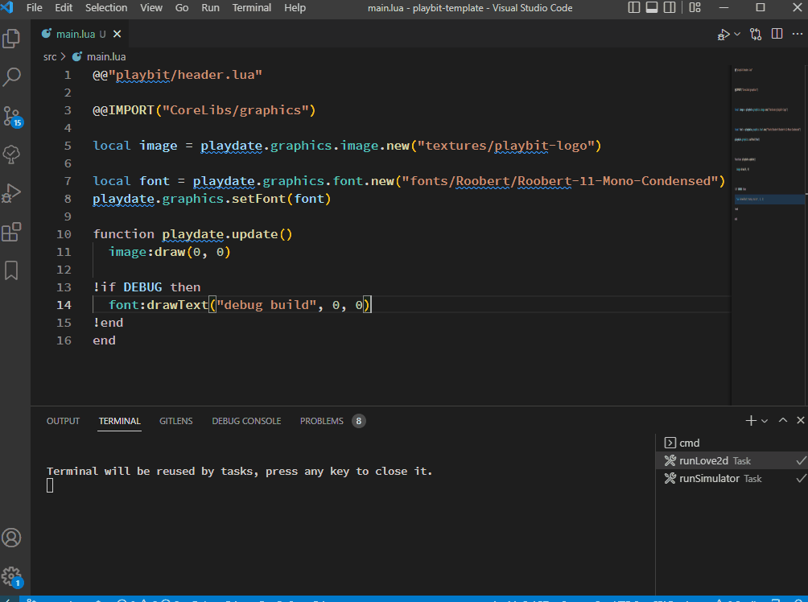

# Playbit

Playbit is a framework for creating cross-platform [Playdate](https://play.date/) games from a single [Lua](https://www.lua.org/) codebase. To accomplish this, it has two key components:
* A reimplemention of the [Playdate API](https://sdk.play.date/Inside%20Playdate.html) in [Love2D](https://love2d.org/).
* A build system that utilizes [LuaPreprocess](https://github.com/GamesRightMeow/LuaPreprocess) to strip/inject platform dependent code.

**⚠ IMPORTANT:** This project is in active development and has not reached a stable 1.0 release yet. Use in a production environment at your own risk. 

## Why should you use Playbit?

If you're looking for a framework for creating cross-platform Playdate games from a single Lua codebase, then that's Playbit's primary goal!

However Playbit's features also can help improve your workflow when working on Playdate-only games too. For example:
- [Builds scripts](build-scripts.md) allow you to create automated build configurations. Do you have a separate demo build and paid build? Create a separate build script for each!
- Process assets at build-time with [file processors](file-processors.md) to generate more performant versions e.g. work directly with [Aseprite (.aseprite)](https://www.aseprite.org/) to retain layers, tags, and other features and then auto-generate PNGs at build-time.
- Compile out blocks of code with [preprocessor flags](core-concepts.md#preprocessor-flags) that aren't relevant for builds e.g. add development tools to test builds without adding bloat to your final production builds.
- Write more performant and maintainable code e.g. instead of calling `math.abs(num)` in a performance critical area (function calls can add up!) you can inline the method with a [macro](core-concepts.md#macros).

Additionally, if you're not creating a cross-platform game, all Playdate SDK functions are available to you since Playbit doesn't need to emulate them for Love2D.

## Current features

* Customizable preprocessor flags
* Customizable build scripts
* Process assets at build-time with file processors
  * Export PNGs from [Aseprite (.aseprite)](https://www.aseprite.org/) files
  * Convert [Caps](https://play.date/caps/) fonts to [BMFonts](https://www.angelcode.com/products/bmfont/)
* Macro support (via LuaPreprocess's [macros](https://github.com/GamesRightMeow/LuaPreprocess/blob/master/docs/extra-functionality.md#insert))
  * Compile asserts out for release builds (via LuaPreprocess's [ASSERT() macro](https://github.com/GamesRightMeow/LuaPreprocess/blob/master/docs/api.md#assert))
* Automatic generation of pdxinfo file with auto-incrementing build number
* A [template repo](https://github.com/GamesRightMeow/playbit-template), featuring:
  * A working barebones example project
  * Example build scripts for common configurations
  * Pre-configured build tasks for VS Code.

Additionally, a core aspect of Playbit is the the implementation of Playdate API in Love2D. It's still a work-in-progress; more functions will be added over time. The following are currently available, with noted caveats:
- `playdate.graphics`
  - Basic drawing functions like `fillRect()`, `line()`, `circ()`, etc
  - Push/pop contexts
  - Draw modes - only `copy`, `fillWhite`, `fillBlack`
- `playdate.image`
- `playdate.imagetable`
- `playdate.easingFunctions`
- `playdate.font`
  - Has limitations, see issue [#20](https://github.com/GamesRightMeow/playbit/issues/20).
- `playdate.sound`
  - Only `sampleplayer` and `fileplayer`
- Some functions under the general `playdate` namespace
  - Input (button presses, crank, etc)
    - Supports remapping
    - Supports keyboards and controllers
  - `getCurrentTimeMilliseconds()`

This list is _not_ comprehensive. For complete details on currently implemented SDK functions, review the [source code](../playdate/) and [review open issues](https://github.com/GamesRightMeow/playbit/issues).

## Documentation
Documentation can be found in the [docs](../docs/) folder. If you're new, it's recommended that you first read [Getting Started](getting-started.md).

If you want to jump straight in, create a new repository using the [Playbit template](https://github.com/GamesRightMeow/playbit-template).

## Get help
If you want to report a bug, request documentation, or ask for feature: [open an issue](https://github.com/GamesRightMeow/playbit/issues).

If you want to ask a question, get help, or start a general discussion topic, you have several avenues:
  - [Start a new Github discussion](https://github.com/GamesRightMeow/playbit/discussions)
  - [Join official Discord server](https://discord.gg/PSt3aCcBtk)
  - Join the [Playbit thread](https://discord.com/channels/675983554655551509/1161743444255965354) in the [Playdate Squad Discord](https://discord.gg/VDqzTmtHR7)